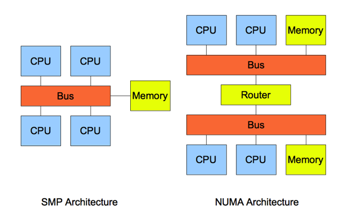
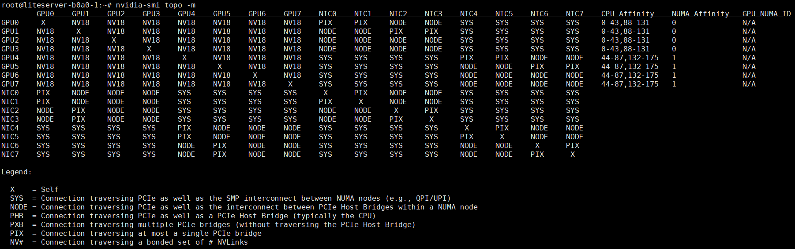

| Model            | Platform| TP | Input length | Concurrency | Broadcast | Odirect| TTFT   |
| --------------- | -------- | -- | -------- | ------ | ---- | -------------- | ------ |
| DeepSeek-V2-Lite | CUDA     | 4  | 4K       | 50     | False   | False             | 463 ms |
| DeepSeek-V2-Lite | CUDA     | 4  | 4K       | 50     | True   | False             | 458 ms |
| DeepSeek-V2-Lite | CUDA     | 4  | 4K       | 50     | False   | True             |  479 ms |
| DeepSeek-V2-Lite | CUDA     | 4  | 4K       | 50     | True   | True             | 454 ms |
| DeepSeek-V2-Lite | Ascend    | 4  | 4K       | 50     | False   | False             | 463 ms |
| DeepSeek-V2-Lite | Ascend    | 4  | 4K       | 50     | True   | False             | 458 ms |
| DeepSeek-V2-Lite | Ascend    | 4  | 4K       | 50     | False   | True             |  479 ms |
| DeepSeek-V2-Lite | Ascend    | 4  | 4K       | 50     | True   | True             | 454 ms |

# NUMA, Shm，PCIe与NVlink

## NUMA (Non Uniform Memory Access)

一些前置知识点：
SMP(猜测是Symmetric Multi Process)，对称多处理器，所有的cpu必须通过相同的内存总线/数据总线访问相同的内存资源/IO资源。所以所有cpu访问内存/IO资源等的速度是一样的，即对称。
Non-NUMA，也称为UMA（Uniform Memory Access）系统所有的CPU通过相同的内存总线共享相同的内存资源。所有CPU对内存的访问时间是相同的，即内存访问延迟一致，不存在本地内存和远程内存的区别，即一致性内存访问系统。
Non-NUMA就是SMP的一种。

NUMA，将CPU划分到多个Node中，每个node有自己独立的内存空间。各个node之间通过高速互联通讯，CPU访问不同类型节点内存的速度是不相同的，访问本地节点的速度最快，访问远端节点的速度最慢，即访问速度与节点的距离有关，距离越远访问速度越慢，即非一致内存访问。缺点：本node的内存不足时，需要垮节点访问内存，节点接的访问速度慢。


SMP的主要特征是共享，系统中所有资源(CPU、内存、I/O等)都是共享的。也正是由于这种特征，导致了SMP服务器的主要问题，那就是它的扩展能力非常有限。由于每个CPU必须通过相同的内存总线访问相同的内存资源，因此随着CPU数量的增加，内存访问冲突将迅速增加，最终会造成CPU资源的浪费，使CPU性能的有效性大大降低。有实验数据表明，SMP型的服务器CPU最好是2-4颗就OK了，多余的就浪费了。

NUMA架构：CPU 厂商把内存控制器集成到 CPU 内部，一般一个 CPU socket 会有一个独立的内存控制器。每个 CPU scoket 独立连接到一部分内存，这部分 CPU 直连的内存称为“本地内存”。CPU 之间通过 QPI（Quick Path Interconnect） 总线进行连接。CPU 可以通过 QPI 总线访问不和自己直连的“远程内存”。NUMA ​​​​​​多CPU分到多个Node中，每个node有自己的物理内存 ，访问本地node的内存速度最快，访问远端node的速度最慢，即访问速度与node的距离有关，距离越远访问速度越慢，即非一致内存访问。

查看设备的numa信息：

```bash
numactl --hardware
```

以H20为例：

```bash
root@liteserver-b0a0-1:~# numactl --hardware
available: 2 nodes (0-1)
node 0 cpus: 0 1 2 3 4 5 6 7 8 9 10 11 12 13 14 15 16 17 18 19 20 21 22 23 24 25 26 27 28 29 30 31 32 33 34 35 36 37 38 39 40 41 42 43 88 89 90 91 92 93 94 95 96 97 98 99 100 101 102 103 104 105 106 107 108 109 110 111 112 113 114 115 116 117 118 119 120 121 122 123 124 125 126 127 128 129 130 131
node 0 size: 515550 MB
node 0 free: 8578 MB
node 1 cpus: 44 45 46 47 48 49 50 51 52 53 54 55 56 57 58 59 60 61 62 63 64 65 66 67 68 69 70 71 72 73 74 75 76 77 78 79 80 81 82 83 84 85 86 87 132 133 134 135 136 137 138 139 140 141 142 143 144 145 146 147 148 149 150 151 152 153 154 155 156 157 158 159 160 161 162 163 164 165 166 167 168 169 170 171 172 173 174 175
node 1 size: 511923 MB
node 1 free: 574 MB
node distances:
node   0   1 
  0:  10  21 
  1:  21  10
```
输出说明CPU 被分成 node 0 和 node 1 两组，node distances 是一个二维矩阵，node[i][j] 表示 node i 访问 node j 的内存的相对距离。比如 node 0 访问 node 0 的内存的距离是 10，而 node 0 访问 node 1 的内存的距离是 21。

再看对应的GPU组的numa分组情况：

```bash
nvidia-smi topo -m
```



可以看到GPU0-3与NUMA0组的内存，CPU亲和，4-7与NUMA组1亲和。GPU 通常通过 PCIe（Peripheral Component Interconnect Express）总线与 CPU 通信。在多Socket系统中，GPU通常只连接到某一个 Socket（及其对应的NUMA节点）上，而不跨 Socket 连接。这意味着在实际运行时，GPU 与连接的那个 Socket 上的 CPU 核心和内存具有更高的带宽和更低的延迟。CPU 和 GPU 之间的通信主要依赖于数据的传输。数据从 CPU 传递到 GPU，再从 GPU 传递回 CPU，过程中涉及到的内存访问操作对性能影响巨大。如果 GPU 绑定的 CPU 核心位于与其相同的 NUMA 节点上，那么数据传输的延迟将显著降低。因此，绑定 CPU 核心与 GPU 的关系是提升性能的关键。

## 测试脚本功能：

| mode | test case |
| ---- | -------------------------------------- |
 | 0 | Rank0 单卡读 pinned | 
 | 1 | 多卡同时读 **同一块** share memory| 
 | 2 | 多卡同时读 **不同 pinned**|
| 3 | pinned → GPU0 → NCCL broadcast 到其他 GPU |

mode 0 单卡读取测试结果：
| Size (MB) | BW (GB/s) 同NUMA|BW (GB/s) 不同NUMA |
| ---- | ----------------|---------------------- |
 | 0.25 |36.490  | 35.582|
 | 0.5 | 43.239  | 43.287|
 | 1 |  48.192   |48.862|
|  2|   51.810   |51.874|
|4|   53.590     |53.693|
|8|   54.568     |54.441|
|16|    55.003   |54.973|
|32|   55.241    |55.233|
|64|  55.376     |55.345|
|128|    55.428  |55.411|
|256|   55.464   |55.448|
|512|  55.477    |55.454|

