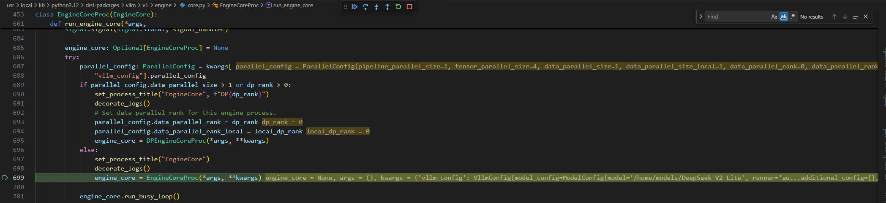
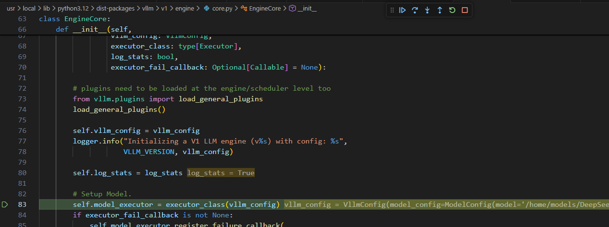
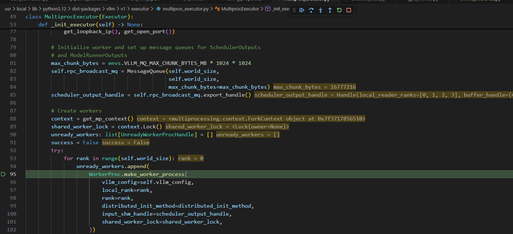
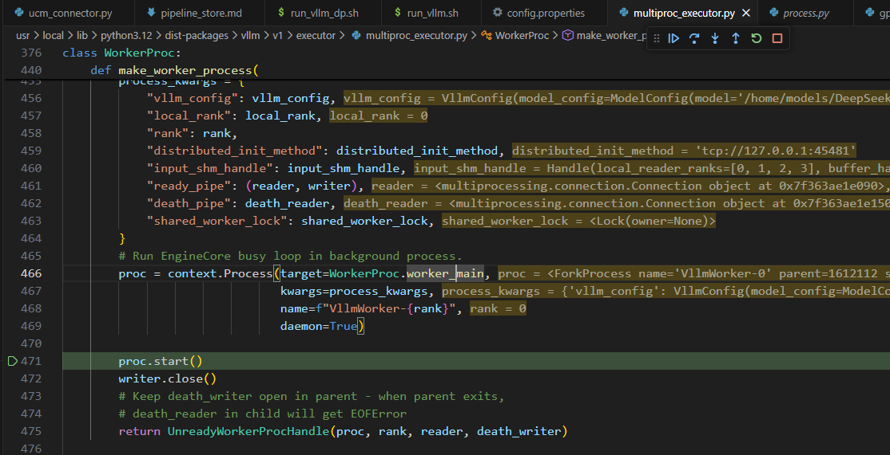
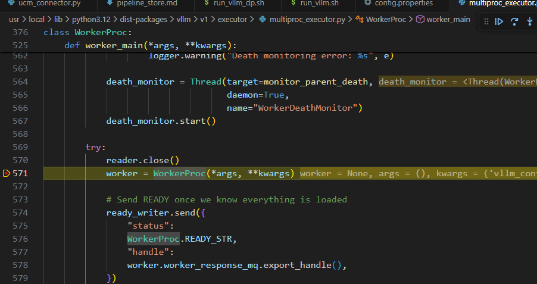
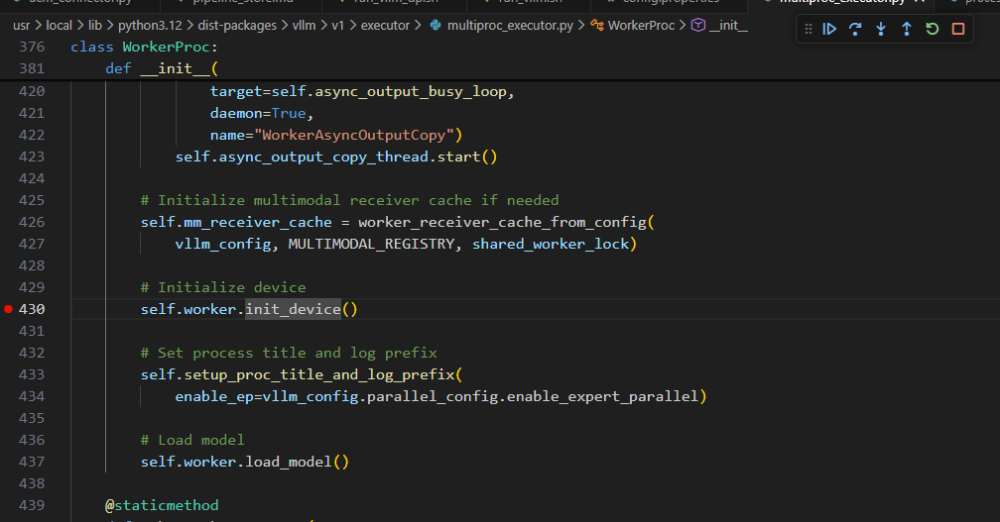
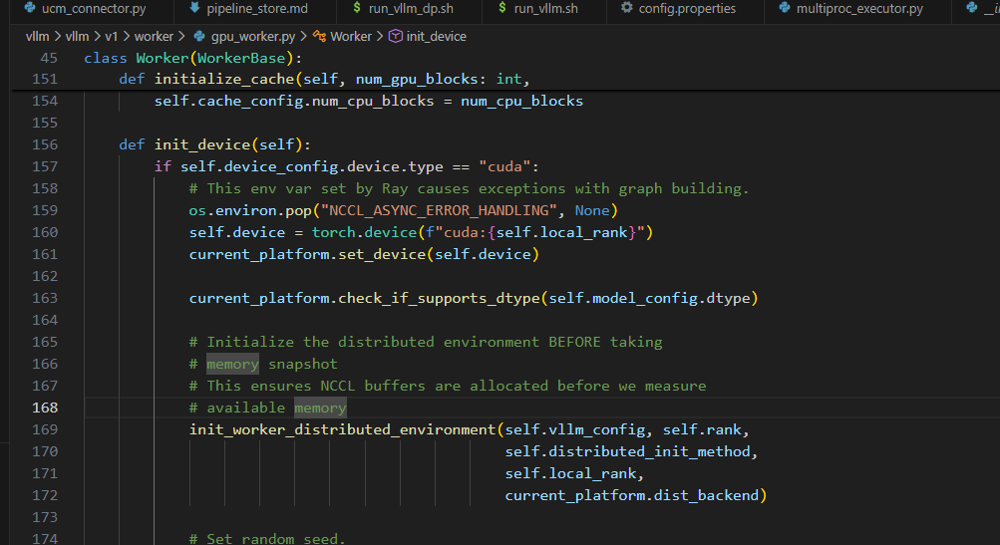
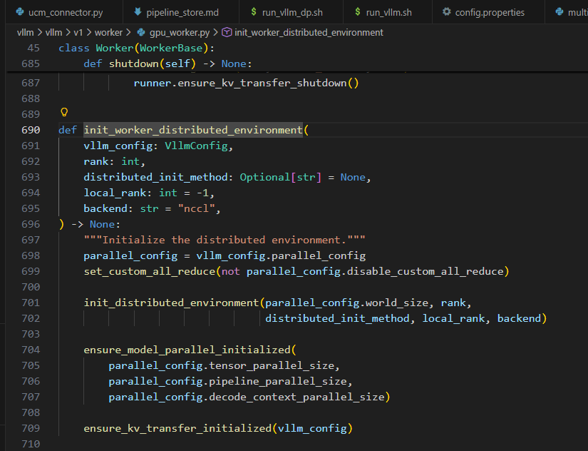

# vLLM

## Cuda Graphs in vLLM 0.11.0

In vLLM v0.11.0, the default Cuda Graph mode is switched from `PIECEWISE` to `FULL_AND_PIECEWISE`, referring this [PR](https://github.com/vllm-project/vllm/pull/25444). Initial piecewise compilation was built to allow piecewise cudagraph capture, excluding cudagraph-unsupported operations (mainly attention). This allowed some speedup from cudagraphs while maintaining compatibility with all attention backends. However, in vLLM 0.11.0, we can config the cuda graph mode by `CompilationConfig.cudagraph_mode` as following:

- `NONE` :  turn CUDA Graphs off. Good for debugging.
- `PIECEWISE` — a single-mode strategy (and past default). It is the most flexible: attention or other CUDA Graphs-incompatible operations stay eager, everything else goes into CUDA Graphs. Requires piecewise compilation.
- `FULL` : a single-mode strategy, which only captures full CUDA Graphs for non-uniform batches, then uniform-decode batches reuse the CUDA Graph of non-uniform batch of the same batch_size, since they are compatible; can be good for small models or workloads with small prompts.
- `FULL_DECODE_ONLY` : full CUDA Graph for uniform decode, no cudagraph for prefill/mixed etc; suitable for decode instances in a P/D setup where prefill is not as important, this way we can save the memory needed for PIECEWISE CUDA Graphs.
- `FULL_AND_PIECEWISE` : (default mode) full CUDA Graph for uniform decode, piecewise CUDA Graphs for others; generally the most performant setting, especially for low latency with small models or MoEs, but also requires the most memory and takes the longest to capture.

When using enforce_eager, using kv connector to offload kv cache will not be affected by this new feature, as in eager mode will not capture cuda graph. However, if turn off enforce eager, the vllm engine will capture cuda graph in `FULL_AND_PIECEWISE` mode by default, resulting in full attention operation and in `_capture_cudagraphs`, `_dummy_run` will conduct fully attention operations and in `unified_attention_with_output`, will try to save kv layer to connector, but in `save_kv_layer` in `SharedStorageConnector`, `connector_metadata = self._get_connector_metadata()` will fail due to not calling the `maybe_get_kv_connector_output`, in which we `bind_connector_metadata`.

We may solve this problem by changing the compilation_config in vllm engine args, or maybe we can modify the /vllm/attention/layer.py.
How to use this argument:

In offline inference, we can config the vllm.LLM EngineArgs as following:

```python
from vllm import LLM
from vllm.engine.arg_utils import EngineArgs

llm_args = EngineArgs(
    model=model,
    kv_transfer_config=ktc,
    max_model_len=5000,
    gpu_memory_utilization=0.8,
    max_num_batched_tokens=30000,
    block_size=128,
    enable_prefix_caching=False,
    compilation_config = {"cudagraph_mode": "PIECEWISE"}
)

llm = LLM(**asdict(llm_args))
```

As for /vllm/attention/layer.py modification, we can monitor `cudagraph_capturing_enabled`, when it is capturing the cuda graph, just skip saving kv cache to connector, so that we can use the default `FULL_AND_PIECEWISE` mode. However, this modification is pending approval of vLLM official, refer to [this issue](https://github.com/vllm-project/vllm/issues/26675). 

```python
# Add import of vllm.compilation.monitor at the beginning of /vllm/attention/layer.py

from vllm.compilation import monitor


def maybe_save_kv_layer_to_connector(
    layer_name: str,
    kv_cache_layer: List[torch.Tensor],
):
    if not has_kv_transfer_group() or not is_v1_kv_transfer_group():
        return

    # If capturing the cudagraph, skip saving
    # kv cache to connector

    if monitor.cudagraph_capturing_enabled:
        return
    connector = get_kv_transfer_group()

    forward_context: ForwardContext = get_forward_context()
    attn_metadata = forward_context.attn_metadata
    if attn_metadata is None:
        return
    assert isinstance(attn_metadata, dict)
    connector.save_kv_layer(layer_name, kv_cache_layer,
                            attn_metadata[layer_name])
```

## Worker Init

vllm中初始化worker的过程如下：

engine_core初始化：


初始化model executor：


multiproc executor循环world size初始化worker进程：


进入worker main：


初始化worker进程：


worker进程初始化device：


进入gpu worker初始化分布式环境：


初始化kv connector：
